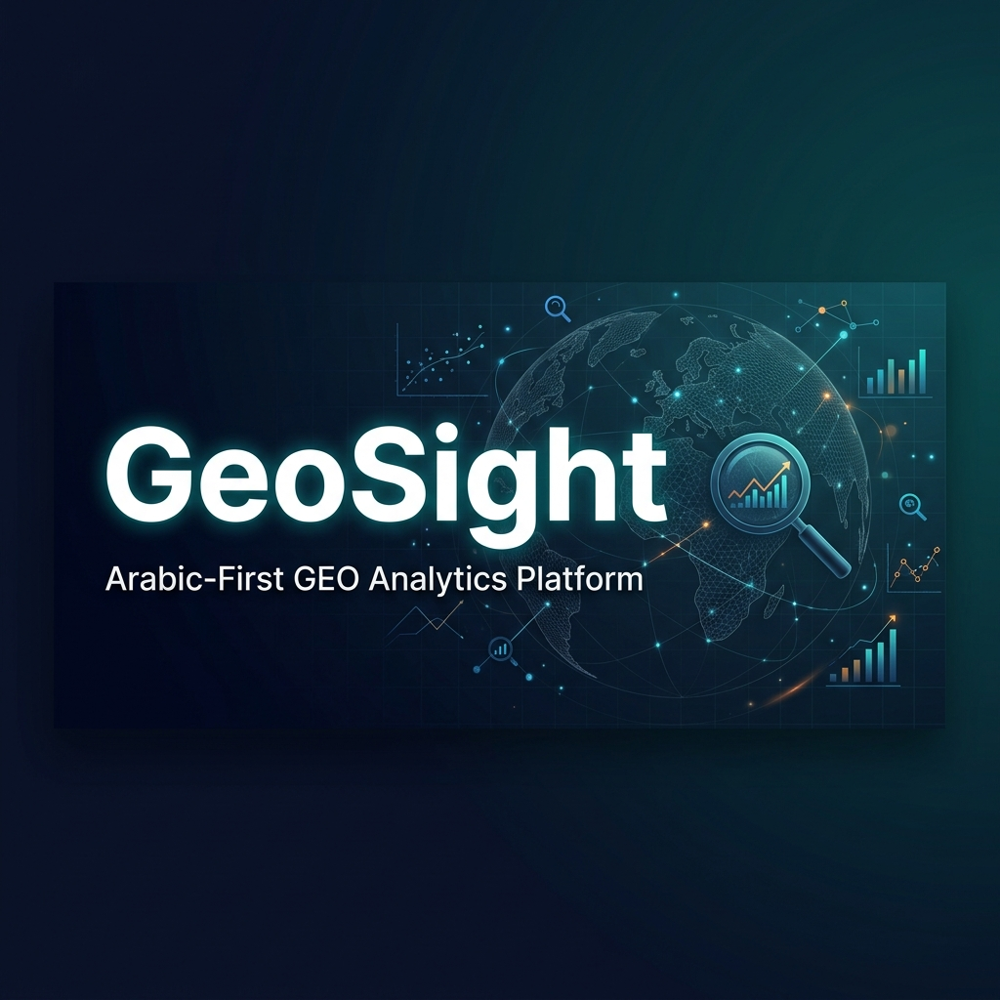

<div align="center">



<br />
<br />

[](https://www.typescriptlang.org/)
[](https://nextjs.org/)
[](https://turbo.build/)
[](https://clerk.com/)
[](https://orm.drizzle.team/)

<h3>🔍 Arabic-First GEO Analytics — Track · Measure · Optimize</h3>

<p>Track how AI search engines (ChatGPT, Gemini, Perplexity) cite and rank your content.<br/>
Optimize your visibility in the age of generative search.</p>

</div>

---

## ❓ What is GEO?

**Generative Engine Optimization (GEO)** is the next evolution of SEO. Instead of optimizing for Google's 10 blue links, GEO focuses on how AI engines — ChatGPT, Gemini, Perplexity, and others — discover, cite, and surface your content in their responses.

**GeoSight** gives you the analytics dashboard to track, measure, and improve your AI visibility — with an **Arabic-first** approach.

---

## 📦 What's In This Repo

This is a **Turborepo monorepo** with shared packages:

### 🟢 Core Application

| Package | Path | Description |
|---|---|---|
| `@geosight/web` | `apps/web/` | Web App — Next.js 14 · App Router · RTL Dashboard |

### 📦 Shared Packages

| Package | Path | Description |
|---|---|---|
| `@geosight/ui` | `packages/ui/` | Shared component library — shadcn/ui based |
| `@geosight/db` | `packages/db/` | Database schema · Drizzle ORM · Migrations |
| `@geosight/shared` | `packages/shared/` | Shared types, utils, and constants |

### 🔧 Backend Workers

| Package | Path | Description |
|---|---|---|
| `workers/scanner` | `workers/scanner/` | Python — BullMQ bridge for website scanning |

> `pnpm dev` runs all apps in parallel via Turborepo.

---

## ✨ What Makes GeoSight Different

| Feature | Description |
|---|---|
| 🌍 **Arabic-First Design** | Full RTL support, Arabic UI, optimized for Arabic content creators |
| 🔍 **AI Citation Tracking** | Monitor when and how AI engines reference your content in their responses |
| 📊 **Real-Time Dashboard** | Live metrics, trends, and performance charts updated in real-time |
| 🏆 **Competitor Benchmarking** | Compare your GEO performance against competitors in your niche |
| 🔑 **Keyword Monitoring** | Track target keywords across multiple AI engines simultaneously |
| 🌐 **Multi-Engine Support** | ChatGPT, Google Gemini, Perplexity, Claude, and more |
| 🛡️ **Enterprise Auth** | Clerk-powered authentication with org-level access control |
| 📈 **SEO + GEO Hybrid** | Traditional SEO metrics alongside new GEO-specific analytics |

---

## 🏗️ Architecture

```
┌──────────────────────────────────────────────────────┐
│                   GeoSight Platform                  │
│                                                      │
│  ┌────────────┐   ┌────────────┐   ┌──────────────┐ │
│  │   Track    │──▶│  Measure   │──▶│   Optimize   │ │
│  │            │   │            │   │              │ │
│  │ AI Engine  │   │ Citation   │   │ Content      │ │
│  │ Crawlers   │   │ Analytics  │   │ Suggestions  │ │
│  │            │   │            │   │              │ │
│  └────────────┘   └────────────┘   └──────────────┘ │
└──────────────────────────────────────────────────────┘
         │                │                 │
         ▼                ▼                 ▼
┌──────────────────────────────────────────────────────┐
│              PostgreSQL + Drizzle ORM                │
│  Keywords · Citations · Competitors · Organizations  │
└──────────────────────────────────────────────────────┘
         │                                  │
         ▼                                  ▼
┌───────────────────┐          ┌────────────────────┐
│  Next.js Web App  │          │  Python Workers    │
│  RTL Dashboard    │          │  BullMQ Scanner    │
│  Clerk Auth       │          │  Redis Cache       │
└───────────────────┘          └────────────────────┘
```

---

## 🛠️ Tech Stack

| Layer | Technology |
|-------|-----------|
| **Framework** | Next.js 14 (App Router) |
| **Language** | TypeScript 5.x + Python |
| **Monorepo** | Turborepo + pnpm Workspaces |
| **Auth** | Clerk |
| **Database** | PostgreSQL + Drizzle ORM |
| **Queue** | BullMQ + Redis |
| **Monitoring** | Sentry |
| **Styling** | Tailwind CSS + shadcn/ui |
| **Validation** | Zod |
| **Deployment** | Vercel (Web) + Render (Workers) |

---

## 🚀 Quick Start

### Prerequisites

- Node.js ≥ 20.11
- pnpm ≥ 9
- Python ≥ 3.10 (for workers)

### Installation

```bash
# Clone the repository
git clone https://github.com/amrolela100-sketch/geosight.git
cd geosight

# Install dependencies
pnpm install

# Set up environment variables
cp .env.example .env.local
# Fill in: CLERK_SECRET_KEY, DATABASE_URL, SENTRY_DSN, REDIS_URL

# Start all dev servers
pnpm dev
```

### Building for Production

```bash
# Build all packages
pnpm build

# Lint everything
pnpm lint

# Type-check everything
pnpm typecheck
```

---

## 🧪 Development Scripts

| Command | Description |
|---------|-------------|
| `pnpm dev` | Start all apps in parallel |
| `pnpm build` | Build all packages |
| `pnpm lint` | Lint all packages |
| `pnpm typecheck` | Type-check all packages |
| `pnpm test` | Run all tests |

---

## 🤝 Contributors

<a href="https://github.com/amrolela100-sketch/geosight/graphs/contributors">
  
</a>

---

<div align="center">

**Built with ❤️ for the Arabic-speaking world**

Helping content creators thrive in the age of AI-powered search.

[Report Bug](https://github.com/amrolela100-sketch/geosight/issues) · [Request Feature](https://github.com/amrolela100-sketch/geosight/issues)

</div>
